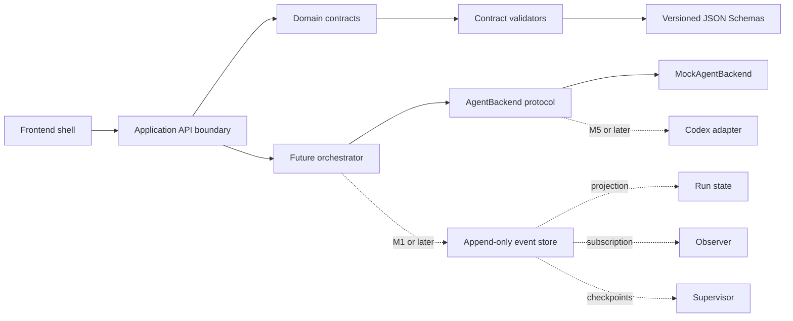

# OralFlow M0 Architecture

## 1. Purpose

This document freezes the M0 architectural boundaries needed before workflow execution or UI development begins. It describes responsibilities and dependency direction; it does not specify a Runtime implementation.

The governing product specification is `docs/development-spec.md`.

## 2. M0 boundary

M0 may deliver contracts, examples, validators, tests, empty application shells, and CI. It must not deliver:

- an executable workflow engine;
- a production workflow editor;
- English-speaking training logic;
- a real Codex or OpenAI integration;
- cloud infrastructure or non-local persistence.

## 3. Logical layers



Dependency direction is inward:

1. JSON Schemas define serialized contracts.
2. Domain types implement those contracts without framework imports.
3. Validators depend on domain contracts and Schema definitions.
4. Application and adapter layers depend on domain types.
5. FastAPI, React, SQLite, local files, and concrete agent providers stay at the edges.

Domain contracts must not import FastAPI, React, database drivers, or a concrete model SDK.

## 4. Core objects

### Workflow

A versioned directed graph containing roles, nodes, edges, policies, inputs, and success criteria. It defines intent and structure, not mutable execution state.

### Node

A typed unit with declared input, configuration, output, error, execution, and permission contracts. A node definition never implies that its output is trusted; produced data must still pass validation.

### Role

A declarative agent role profile containing context visibility, tool and path permissions, model profile, output Schema, budget, and escalation rules. A role identifies required capability without naming a concrete provider model.

### Run

A mutable projection of execution facts for one pinned Workflow revision. Run state is derived from Events rather than treated as an independent source of truth.

### Event

An immutable, append-only fact about a Run, node, role, approval, validation, budget, or supervisor decision. Events are ordered per Run and carry stable identifiers and timestamps.

### Artifact

A versioned reference to a file or structured role output. Artifacts carry media type, digest, producer, Schema reference, and provenance. Artifact content is stored separately from Workflow definitions and Events.

## 5. Object references

- A Workflow embeds or references Node and Role instances validated by their Schemas.
- `Node.role_id` must resolve to exactly one Role in the same effective Workflow scope.
- Edge endpoints must resolve to Node IDs in the same graph.
- A subworkflow node references a specific child Workflow ID and compatible version.
- A Run pins Workflow ID, Workflow version, revision, and content digest.
- An Event always references a Run and Workflow; node and role references are conditionally required by event type.
- Node outputs and Events reference Artifacts by stable artifact URI rather than embedding large content.

JSON Schema verifies structural references. The workflow contract validator verifies instance-level referential integrity.

## 6. Validation boundary

Validation is ordered from cheapest and most deterministic to more semantic checks:

1. JSON syntax.
2. JSON Schema self-validation.
3. Instance validation against the declared `schema_version`.
4. Identifier uniqueness and reference resolution.
5. Graph reachability, terminal paths, and bounded cycles.
6. Node input/output compatibility.
7. Role context and permission compatibility.
8. Budget, retry, and subworkflow-depth limits.
9. Artifact existence and digest checks when storage exists.

An Agent output may enter the next stage only after its declared output Schema passes. Invalid output creates a structured validation failure and follows a bounded retry, replan, stop, or human-escalation path.

## 7. Event and state boundary

Events are the durable facts. Run and node status are projections.

- Event records are append-only.
- Projection code must be deterministic and replayable.
- A state transition must identify the Event that caused it.
- Correcting an event means appending a compensating event, not editing history.
- Large payloads are stored as Artifacts and referenced by digest.

M0 freezes these rules but does not implement persistence or replay.

## 8. Observer and Supervisor

Observer is a read-only telemetry role:

- subscribes to events;
- records elapsed time, budget use, failures, drift, and unresolved risks;
- emits observations;
- cannot route execution, modify code, or grant acceptance.

Supervisor is a control-plane role:

- reads validated Events and observations at declared checkpoints;
- emits `CONTINUE`, `RETRY`, `REPLAN`, `ROLLBACK`, `ESCALATE`, `STOP`, or `ACCEPT`;
- cannot produce business artifacts or modify application code;
- must provide reason, evidence references, and the remaining budget.

Supervisor decisions are represented as structured Events, not ordinary graph edges.

## 9. Agent adapter boundary

The workflow core depends on a provider-neutral `AgentBackend` protocol with domain request and response objects. The minimum conceptual operations are:

```text
start_context
run_role
resume_context
fork_context
compact_context
cancel
```

`MockAgentBackend` returns deterministic fixtures and never accesses a model or network.

A future Codex adapter translates Codex-specific context, events, responses, and failures at the boundary. Codex SDK types, model names, and transport details must not appear in Workflow, Node, Role, Run, Event, or Artifact contracts.

## 10. Storage boundary

MVP storage uses SQLite for indexes and state projections plus the local filesystem for artifacts. Storage interfaces must allow later replacement, but M0 does not introduce PostgreSQL, Redis, object storage, migrations, or production data.

## 11. Security boundary

- Roles receive only declared context.
- Write access is path-scoped.
- Commands are classified as safe, review-required, or dangerous.
- Secrets, recordings, local databases, and generated runtime artifacts remain outside Git.
- Structured logs redact credentials and personal source material.
- Real external calls are forbidden in M0 tests.

## 12. Milestone handoff

M0 is complete only when the contracts, examples, validators, tests, empty application shells, and CI agree. M1 may then implement the deterministic workflow core without changing frozen contracts unless a reviewed migration is added.
