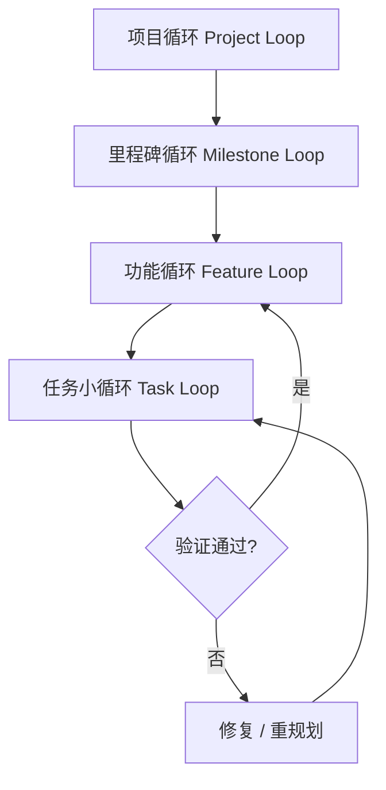
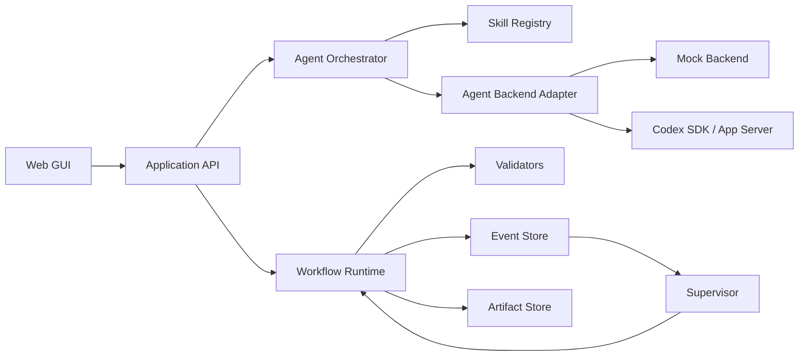

# OralFlow 开发总纲

**副标题：基于 Harness Engineering 的可视化多 Agent 工作流系统**  
**文档状态：Draft v0.1**  
**适用阶段：Codex 辅助开发、MVP 架构冻结、后续需求迭代**  
**目标运行环境：Windows 本地开发；Codex 桌面应用辅助编码；Node.js + Miniconda Python**

---

## 1. 项目目标

OralFlow 的第一垂直场景是英语口语训练。用户可以提交工作总结、项目报告、会议材料或简短口述需求，由右侧 Agent 将目标转换为可执行工作流。用户在 GUI 中查看节点、连线、条件分支、循环、运行状态和输出结果，并可继续通过对话创建、修改、解释或诊断工作流。

系统同时保留通用复杂任务编排能力。英语口语训练属于首个领域模板，底层工作流内核、角色系统、上下文管理、验证器和监督机制保持通用。

核心交互链路：

```text
简短自然语言需求 / 用户材料
        ↓
Agent Skill 识别任务意图
        ↓
生成结构化 TaskIntent
        ↓
7+1 角色协作规划
        ↓
生成或修改 Workflow JSON
        ↓
Schema、图结构、权限与预算校验
        ↓
GUI 画布预览与用户确认
        ↓
Runtime 执行最小可验证循环
        ↓
证据、日志、产物与验收结论
        ↓
继续下一小循环或结束任务
```

---

## 2. 产品边界

### 2.1 MVP 必须完成

1. 三栏 GUI：左侧节点库、中间工作流画布、右侧 Agent 对话区。
2. 用户通过简短口述需求创建或修改节点与连线。
3. 工作流以 JSON 文件保存、校验、版本化和执行。
4. 支持顺序节点、条件分支、有限循环、人工确认和子工作流。
5. 支持 7+1 角色完成计划、开发、检查、审核、验收与监督。
6. 每个执行单元形成最小可验证循环，并输出证据包。
7. 支持多上下文隔离、线程恢复、分叉、压缩和父子工作流摘要回传。
8. 完成一个英语口语训练闭环：工作总结 → B1 汇报稿 → Shadowing → 录音转写 → 评价 → 薄弱句重练。

### 2.2 MVP 暂缓

- 多用户协作与权限组织体系。
- 云端部署、付费系统与插件市场。
- 任意深度、无资源约束的递归执行。
- 高精度音素级口音评分。
- 自动操作 Codex 桌面 GUI。
- 未经确认的大范围代码重构或生产环境操作。

---

## 3. Harness Engineering 总体原则

### 3.1 确定性控制包裹概率性能力

模型负责理解、规划、生成、分析和提出判断；工程框架负责输入输出契约、状态机、预算、权限、重试、证据、验收、暂停和退出。任何模型输出进入下一节点前都必须通过结构化校验。

### 3.2 产物驱动

角色之间不依赖大段自由对话传递状态。每一步必须形成结构化产物，例如：

- `task_intent.json`
- `plan.json`
- `plan_review.json`
- `patch_manifest.json`
- `test_report.json`
- `review_report.json`
- `acceptance_report.json`
- `supervisor_decision.json`

下游角色读取已声明的产物和必要上下文，减少信息漂移。

### 3.3 Schema First

工作流、节点、角色配置、运行状态、错误、证据包和 Agent 输出均先定义 Schema，再实现业务逻辑。新增字段需要版本号和迁移策略。

### 3.4 最小可验证循环

一个开发小循环只解决一个可以独立验证的目标，例如“实现条件节点并通过 8 个单元测试”。禁止在同一小循环中同时完成无关模块、GUI 美化和架构迁移。

### 3.5 有界递归

系统支持工作流嵌套和上下文递归组合，但不承诺真正意义上的“无限套娃”。每个父子工作流必须配置：

- 最大嵌套深度；
- 最大子任务数量；
- Token、时间和工具调用预算；
- 最大失败与重规划次数；
- 明确成功、失败和人工升级条件；
- 祖先链检测，防止循环引用。

建议初始值：`max_depth = 3`，稳定后再开放到 5。

### 3.6 独立验证

开发者不能自行给出最终验收结论。计划检查、代码审核和验收角色拥有独立上下文与只读证据视图。

### 3.7 全程可观察

每次角色调用、节点执行、工作流跳转和人工确认都写入事件流。系统可以回答：当前做到了哪里、为何进入该分支、使用了哪些输入、生成了哪些改动、依据什么判定通过。

### 3.8 可替换模型

角色绑定的是 `model_profile`，业务逻辑不直接依赖具体模型名称。运行时根据可用模型、成本、速度和任务难度解析实际模型。

---

## 4. 循环层级

项目采用四级循环，每一层都由若干下级循环构成。



### 4.1 任务小循环

```text
接收一个原子目标
→ 生成计划
→ 检查计划
→ 实现
→ 自动测试
→ 代码审核
→ 验收
→ 监督者决定结束、返工或升级
```

### 4.2 功能循环

聚合多个任务小循环，交付一个用户可见行为，例如“用户可以在画布上创建条件节点并成功运行”。

### 4.3 里程碑循环

聚合多个功能循环，完成一段稳定能力，例如“工作流 Runtime 可执行顺序、条件和有限循环”。

### 4.4 项目循环

围绕产品目标、用户反馈和版本发布持续迭代。项目循环只读取里程碑证据与风险摘要，避免把全部底层上下文堆入同一线程。

---

## 5. 7+1 Agent 角色架构

第一版按 **7 个执行角色 + 1 个监督者** 设计。观察者负责记录事实，监督者负责跨角色治理，两者职责分离。

| 编号 | 角色 | 核心职责 | 默认权限 | 主要输出 |
|---|---|---|---|---|
| R1 | 需求发起者 / Intent Agent | 将简短口述需求转换为明确目标、约束和验收口径 | 只读项目资料 | `task_intent.json` |
| R2 | 计划者 / Planner | 拆分最小任务、选择节点与执行顺序、估算预算 | 只读代码与文档 | `plan.json` |
| R3 | 计划检查者 / Plan Critic | 检查遗漏、依赖、不可验证目标、风险和范围膨胀 | 只读 | `plan_review.json` |
| R4 | 开发者 / Implementer | 按批准计划修改代码、配置或工作流 | 限定目录写入、受控命令 | 代码改动、`patch_manifest.json` |
| R5 | 全程观察者 / Observer | 监听事件、记录偏离、失败、耗时、预算和未解决问题 | 只读事件流 | `observation_log.jsonl` |
| R6 | 审核者 / Reviewer | 审查差异、契约、测试、可维护性、安全与回归风险 | 只读代码和 Diff | `review_report.json` |
| R7 | 验收者 / Acceptance Agent | 按用户行为和验收标准运行测试，给出通过/不通过证据 | 测试执行，禁止改生产代码 | `acceptance_report.json` |
| R8 | 监督者 / Supervisor | 监控主线依赖、死锁、重复失败、目标漂移和角色冲突，决定暂停、重规划、返工或人工升级 | 控制面权限，默认不写代码 | `supervisor_decision.json` |

### 5.1 监督者为何独立存在

线性主链容易出现三类问题：前序角色结论被后序角色直接继承；计划者与开发者共同偏离原始目标；主线失败后缺少独立角色判断应该继续修复、重新规划还是终止。

监督者运行在控制面，订阅全程事件，但不承担业务产物生成。它在检查点做治理决策：

```text
CONTINUE       继续当前计划
RETRY          在相同计划下有限重试
REPLAN         返回计划层重新拆分
ROLLBACK       回滚最近改动
ESCALATE       请求用户补充或人工裁决
STOP           预算耗尽、风险过高或目标不可达
ACCEPT         证据充分，结束当前循环
```

监督者不能直接修代码，避免同时担任裁判和运动员。

### 5.2 角色模型与人格配置

每个角色由独立配置文件声明：

```json
{
  "role_id": "plan_critic",
  "skill": "skills/plan-critic/SKILL.md",
  "model_profile": "reasoning_high_readonly",
  "personality_profile": "skeptical_engineer",
  "tool_policy": "readonly_repo",
  "context_policy": "plan_plus_architecture",
  "output_schema": "schemas/plan-review.schema.json",
  "timeout_seconds": 600
}
```

人格主要通过角色 Skill、局部指令和输出 Schema 实现。模型可按角色替换，实际可用模型由运行时查询，不在工作流文件中写死。

---

## 6. 多上下文管理与递归子工作流

### 6.1 Context Capsule

每个角色只获得完成当前任务所需的上下文胶囊：

```json
{
  "goal": "实现 control.condition 节点",
  "constraints": ["不得执行任意代码", "不得修改公共 Schema"],
  "relevant_files": ["backend/runtime/condition.py"],
  "prior_artifacts": ["plan.json", "plan_review.json"],
  "acceptance_criteria": ["缺少变量时返回 NODE_INPUT_INVALID"],
  "budget": {"tokens": 30000, "seconds": 900}
}
```

上下文胶囊禁止默认携带整个项目聊天历史。父层保留目标、决策和证据索引，子层读取局部文件与必要摘要。

### 6.2 子工作流节点

复杂任务通过 `subworkflow` 节点递归拆解：

```text
父工作流
  ├─ 子工作流 A：工作流 Schema
  ├─ 子工作流 B：Runtime
  │      ├─ 子任务 B1：状态机
  │      └─ 子任务 B2：条件节点
  └─ 子工作流 C：GUI 画布
```

父工作流只接收子工作流的标准回传：

```json
{
  "status": "completed",
  "summary": "条件节点已实现并通过测试",
  "artifacts": ["patch_manifest.json", "test_report.json"],
  "verdict": "accepted",
  "open_risks": [],
  "metrics": {"attempts": 2, "duration_seconds": 438}
}
```

### 6.3 上下文生命周期

```text
CREATE     创建独立上下文
RUN        执行一个角色或子工作流
SNAPSHOT   保存状态与产物索引
COMPACT    压缩历史，只保留决策和证据
FORK       从检查点分叉方案
RESUME     恢复既有上下文
MERGE      仅合并已验收产物，不合并全部对话
ARCHIVE    归档完成上下文
```

### 6.4 防止递归失控

运行前检查：

- `depth < max_depth`
- `child_count < max_children`
- 当前 workflow ID 不在祖先链中
- 子任务验收标准可自动或人工验证
- 子任务预算小于父任务剩余预算
- 子工作流存在退出节点

连续两次以相同错误失败时，默认进入 `REPLAN`；连续三次仍失败时，进入 `ESCALATE`。

---

## 7. Agent Skills 与 Codex 集成原则

### 7.1 Skill 的定位

Skill 用于封装可复用的角色工作方式、资源、脚本和输出规范。建议目录：

```text
skills/
├── requirement-interpreter/
│   ├── SKILL.md
│   ├── references/
│   └── scripts/
├── planner/
├── plan-critic/
├── implementer/
├── observer/
├── reviewer/
├── acceptance/
└── supervisor/
```

每个 `SKILL.md` 至少描述：触发条件、输入、步骤、禁止行为、输出 Schema、失败处理和退出条件。

### 7.2 Codex 在系统中的位置

Codex 是可替换的执行后端之一，主要承担：

- 读取角色 Skill 和项目指令；
- 理解简短需求；
- 生成或修改工作流 JSON；
- 在受限目录内修改代码；
- 运行测试和输出结构化结果；
- 创建、恢复或分叉独立任务线程。

产品运行时不通过自动点击 `Codex.exe` 操作桌面界面。开发期可以直接使用 Codex 桌面应用协助编码；产品内集成阶段通过 Codex SDK 或 App Server Adapter 对接。

### 7.3 Adapter 隔离

Codex 集成必须放在独立适配层：

```python
class AgentBackend(Protocol):
    def start_context(self, request: StartContextRequest) -> ContextRef: ...
    def run_role(self, request: RoleRunRequest) -> RoleRunResult: ...
    def resume_context(self, context_id: str) -> ContextRef: ...
    def fork_context(self, context_id: str, checkpoint: str | None) -> ContextRef: ...
    def compact_context(self, context_id: str) -> None: ...
    def cancel(self, run_id: str) -> None: ...
```

初期提供两个实现：

1. `MockAgentBackend`：不接真实模型，用固定样本跑通 Harness。
2. `CodexAgentBackend`：后续调用 Codex SDK/App Server。

这样可以避免 SDK 版本变化影响工作流内核。

### 7.4 AGENTS.md 分层

根目录 `AGENTS.md` 声明全项目规则；前端、后端、Schema、Skills 等目录可使用局部 `AGENTS.md` 或 override 文件收紧规则。角色 Skill 负责“如何完成某类任务”，AGENTS 文件负责“在当前代码库中必须遵守什么”。

---

## 8. Workflow JSON 设计

### 8.1 顶层结构

```json
{
  "schema_version": "0.1.0",
  "workflow_id": "wf_condition_node_001",
  "name": "实现条件节点",
  "goal": "完成 control.condition 节点并通过验收",
  "status": "draft",
  "inputs": {},
  "roles": [],
  "nodes": [],
  "edges": [],
  "policies": {},
  "success_criteria": [],
  "metadata": {}
}
```

### 8.2 节点类型

```text
input            用户、文件或系统输入
agent_task       调用一个角色 Agent
code_task        受限代码修改任务
command          受控命令或测试
transform        确定性数据转换
gate             条件判定
human_approval   用户确认
subworkflow      子工作流
artifact         产物保存
terminal         成功、失败或取消出口
```

### 8.3 节点样例

```json
{
  "id": "review_plan",
  "kind": "agent_task",
  "role_id": "plan_critic",
  "inputs": {
    "plan": {"$ref": "artifact://plan.json"},
    "architecture": {"$ref": "file://docs/architecture.md"}
  },
  "config": {
    "max_attempts": 1,
    "timeout_seconds": 600
  },
  "outputs": {
    "report": "artifact://plan_review.json"
  },
  "gate": {
    "expression": "report.verdict == 'approved'"
  }
}
```

### 8.4 子工作流节点样例

```json
{
  "id": "build_runtime",
  "kind": "subworkflow",
  "workflow_ref": "workflows/runtime-core.json",
  "context_policy": {
    "isolation": "separate",
    "return_mode": "summary_and_artifacts",
    "max_depth": 3
  },
  "budget": {
    "max_turns": 20,
    "max_duration_seconds": 7200
  }
}
```

### 8.5 Edge 类型

```text
normal       正常数据流
conditional  条件分支
retry        有限重试
error        错误处理
supervisory  监督者控制信号
```

### 8.6 关键验证器

1. Schema Validator：字段与类型。
2. Graph Validator：入口、出口、可达性、循环和断图。
3. Contract Validator：上下游输入输出兼容。
4. Permission Validator：角色与工具权限。
5. Budget Validator：时间、Token、重试和嵌套深度。
6. Artifact Validator：引用产物存在且版本兼容。
7. Safety Validator：危险命令、路径越界和密钥泄露。

---

## 9. GUI 信息架构

### 9.1 左侧：节点库

分组建议：

- 输入：文本、文件、目标、人工确认。
- 计划：需求解析、规划、计划检查。
- 开发：代码修改、命令执行、文件生成。
- 验证：单元测试、集成测试、审核、验收。
- 控制：条件、循环、监督、错误处理、子工作流。
- 口语训练：材料解析、B1 改写、Shadowing、录音、转写、评价。
- 输出：报告、表达库、日志、导出。

普通用户看到复合节点；高级模式允许展开原子节点和子工作流。

### 9.2 中间：工作流画布

节点卡片至少显示：

```text
名称 / 角色
输入输出摘要
当前状态
尝试次数
预算消耗
最近产物
验收结论
```

画布支持：拖放、连接、展开子工作流、自动对齐、运行单节点、运行到此处、从此处重跑、暂停、恢复、回滚、查看 Diff 和查看证据。

### 9.3 右侧：Agent 对话区

支持四类用户命令：

```text
CREATE     根据需求创建工作流
MODIFY     修改节点、连线、阈值或角色
EXPLAIN    解释当前工作流和分支逻辑
DIAGNOSE   分析失败、死循环、预算或结果偏离
```

Agent 的每次修改先生成 `Workflow Patch`，通过校验后展示差异。高影响变更必须等待用户确认。

### 9.4 底部：运行与证据面板

显示事件时间线、角色调用、节点输入输出、命令日志、测试结果、预算消耗、监督决策和最终证据包。

---

## 10. 简短需求沟通协议

多数需求允许用户用一两句话表达，例如：

> 给工作流增加一个审核角色，开发完成后先做代码审查，通过后再验收。

系统按以下流程处理：

```text
识别目标和影响范围
→ 从项目默认策略补全非关键参数
→ 标记真正阻塞的歧义
→ 生成 Workflow Patch
→ 自动校验
→ 展示变更摘要和画布 Diff
→ 用户确认
→ 执行
```

仅在以下信息无法由项目默认值推断时追问：

- 成功标准存在多种互斥解释；
- 涉及删除、发布、密钥、生产数据或不可逆操作；
- 目标文件、材料或权限缺失；
- 预算和交付范围差异过大。

Agent 不因缺少普通偏好频繁打断用户。默认值必须来自版本化项目策略，禁止临时猜测。

---

## 11. Runtime 与状态机

### 11.1 WorkflowRun 状态

```text
DRAFT
VALIDATING
READY
RUNNING
WAITING_FOR_USER
PAUSED
REPLANNING
COMPLETED
FAILED
CANCELLED
```

### 11.2 NodeRun 状态

```text
IDLE
QUEUED
RUNNING
WAITING_APPROVAL
SUCCEEDED
REJECTED
RETRYABLE_FAILED
TERMINAL_FAILED
SKIPPED
CANCELLED
```

### 11.3 事件模型

```json
{
  "event_id": "evt_001",
  "run_id": "run_001",
  "workflow_id": "wf_001",
  "node_id": "implement",
  "role_id": "implementer",
  "type": "NODE_COMPLETED",
  "timestamp": "2026-07-31T15:00:00+08:00",
  "payload": {
    "artifact_refs": ["artifact://patch_manifest.json"],
    "duration_seconds": 328
  }
}
```

事件采用追加写入。当前状态由事件投影生成，便于回放和诊断。

### 11.4 失败策略

```text
结构错误       → 不执行，返回生成或配置环节
临时工具失败   → 指数退避后有限重试
测试失败       → 返回开发者修复
审核不通过     → 按审核问题创建修复任务
验收不通过     → 返回计划者或开发者，由监督者判断
目标漂移       → 立即暂停并重新读取 TaskIntent
预算超限       → Supervisor 决定压缩、降级或停止
重复失败       → REPLAN / ESCALATE
```

---

## 12. 证据包与验收

每个最小循环必须产生统一证据包：

```json
{
  "task_id": "task_condition_node",
  "goal": "实现安全的条件节点",
  "changed_files": [],
  "commands": [],
  "tests": [],
  "review": {},
  "acceptance": {},
  "open_risks": [],
  "verdict": "accepted"
}
```

验收角色必须按行为验证，不以“代码看起来正确”代替运行证据。至少包含：

- 需求与实现映射；
- 自动测试结果；
- 关键失败路径；
- 回归结果；
- 未解决风险；
- 可复现命令或操作步骤。

---

## 13. 安全与权限

### 13.1 最小权限

- Planner、Critic、Observer、Reviewer 默认只读。
- Implementer 仅能写入任务声明的目录。
- Acceptance 可运行测试，不得修复代码。
- Supervisor 可暂停和路由，不得直接写代码。

### 13.2 命令分级

```text
SAFE       读取、lint、单元测试
REVIEW     安装依赖、数据库迁移、批量格式化
DANGEROUS  删除、覆盖、发布、生产访问、密钥操作
```

`REVIEW` 需要策略允许或人工确认；`DANGEROUS` 必须人工确认。

### 13.3 本地数据

工作材料、录音、`.env`、Token、密钥和运行产物默认不提交 Git。Agent 输出日志需要对密钥和个人数据做遮蔽。

---

## 14. 技术架构

### 14.1 初始技术栈

```text
Frontend     React + TypeScript + Vite
Backend      Python 3.12 + FastAPI + Pydantic
Environment  Miniconda 环境 oralflow
Database     SQLite（MVP）
Artifacts    本地文件系统（MVP）
Workflow     JSON + JSON Schema
Transport    HTTP + WebSocket / Server-Sent Events
Testing      pytest + TypeScript 测试工具
Versioning   Git
```

### 14.2 模块划分



### 14.3 推荐目录

```text
oralflow/
├── AGENTS.md
├── README.md
├── environment.yml
├── frontend/
│   ├── AGENTS.md
│   └── src/
├── backend/
│   ├── AGENTS.md
│   └── oralflow/
│       ├── api/
│       ├── domain/
│       ├── runtime/
│       ├── orchestrator/
│       ├── context/
│       ├── supervisor/
│       ├── adapters/
│       ├── validators/
│       ├── events/
│       └── artifacts/
├── schemas/
├── skills/
├── workflows/
│   ├── templates/
│   ├── examples/
│   └── regression/
├── docs/
│   ├── architecture.md
│   ├── workflow-dsl.md
│   ├── role-contracts.md
│   ├── context-management.md
│   ├── security.md
│   └── decisions/
├── tests/
│   ├── unit/
│   ├── contract/
│   ├── integration/
│   ├── workflow/
│   └── end_to_end/
└── data/                 # Git ignored
```

---

## 15. 开发阶段

### M0：工程 Harness 与契约冻结

目标：在业务编码前建立开发规则、Schema、角色契约和测试入口。

交付：

- 根目录与局部 `AGENTS.md`；
- 架构文档与 ADR；
- Workflow、Node、Role、Run、Event、Artifact Schema；
- CI 中的 lint、类型检查和空测试；
- `MockAgentBackend` 接口草案。

通过标准：空项目可重复安装、启动、校验示例 JSON 并通过 CI。

### M1：无 GUI 的工作流内核

目标：先证明顺序、条件、有限循环、暂停、恢复和事件回放。

使用玩具工作流：

```text
Text Input
→ Uppercase Transform
→ Length Evaluation
→ Condition
  ├─ 合格 → Complete
  └─ 不合格 → Retry（最多 2 次）
```

通过标准：CLI 或自动测试可运行，状态与事件完全可追踪，无死循环。

### M2：7+1 角色协作小循环

目标：使用 Mock Agent 跑通需求、计划、计划检查、开发、观察、审核、验收和监督。

通过标准：每个角色只接收声明上下文；所有输出满足 Schema；监督者可触发继续、返工、重规划和停止。

### M3：可视化 GUI

目标：实现三栏界面、节点拖放、连线、配置、运行状态、子工作流展开、Diff 和证据查看。

通过标准：用户可在 GUI 中构建并运行 M1 玩具工作流；刷新后恢复工作流和运行记录。

### M4：对话创建工作流

目标：用户通过右侧 Agent 用简短需求生成和修改工作流。

先用 Mock 输出，再接 Codex Adapter。

通过标准：Agent 只使用注册节点；Workflow Patch 通过验证后才进入画布；修改可撤销；高影响操作需确认。

### M5：Codex SDK / App Server 集成

目标：实现上下文创建、恢复、分叉、压缩、角色调用和流式事件。

通过标准：Codex 集成可被 Mock 替换；SDK 异常不会破坏 Runtime；每个线程绑定角色、目录、权限和预算。

### M6：递归子工作流与上下文管理

目标：复杂任务可拆成子工作流，父层只接收摘要和验收产物。

通过标准：支持深度限制、祖先链检测、预算继承、子工作流失败回传和检查点恢复。

### M7：英语口语训练垂直闭环

目标：

```text
工作总结
→ 事实提取
→ B1 汇报稿
→ 人工确认
→ 句子切分
→ Shadowing
→ 录音与转写
→ 完整度和关键信息评价
→ 薄弱句重练
→ 训练报告
```

通过标准：一份真实脱敏工作总结可以从材料输入走到最终报告；训练中断后可恢复；所有结果有来源和证据。

### M8：强化、评测与发布准备

目标：安全、性能、错误恢复、回归样本、成本和可观察性完善。

通过标准：核心工作流拥有端到端回归；故障注入不会导致丢失运行状态；敏感数据不进入 Git 或普通日志。

---

## 16. Codex 开发协作协议

每次交给 Codex 的任务采用固定模板：

```text
任务目标：
背景与原因：
允许修改的目录：
禁止修改的目录：
必须读取的文档：
输入与现有接口：
期望输出：
测试要求：
验收标准：
最大改动范围：
是否允许安装依赖：
```

Codex 单次执行顺序：

```text
读取 AGENTS.md 和相关文档
→ 检查仓库状态
→ 输出实施计划
→ 等待确认（高影响任务）
→ 完成一个最小改动
→ 运行规定测试
→ 输出 Diff 摘要和证据
→ 不自行扩大任务范围
```

### 首个开发任务

```text
任务目标：建立 OralFlow 的 M0 工程骨架和契约文档。

当前只完成工程基础，不实现 GUI、模型调用和口语业务。

必须创建：
- AGENTS.md
- README.md
- environment.yml
- docs/architecture.md
- docs/workflow-dsl.md
- docs/role-contracts.md
- schemas/workflow.schema.json
- schemas/node.schema.json
- schemas/role.schema.json
- schemas/run.schema.json
- schemas/event.schema.json
- frontend/ 与 backend/ 基础目录
- tests/ 基础目录

执行要求：
1. 先检查当前目录和已有文件。
2. 先输出实施计划，不立即修改。
3. 不安装未经确认的依赖。
4. 不接入真实 Codex SDK 或 OpenAI API。
5. 不实现英语训练功能。
6. 每一步给出文件变更摘要。
7. 创建最小示例 Workflow JSON 和 Schema 校验测试。
```

---

## 17. MVP 完成定义

第一版满足以下条件才可标记为完成：

1. 用户可用简短自然语言创建或修改工作流。
2. Agent 生成的是可验证、可版本化的 JSON，而非只存在于对话中的计划。
3. GUI 能展示节点、连线、子工作流、状态、Diff 和证据。
4. Runtime 支持顺序、条件、有限循环、人工确认、错误分支和子工作流。
5. 7+1 角色拥有独立契约、上下文和权限。
6. 监督者可以识别死锁、重复失败、目标漂移和预算超限。
7. 每个最小循环均有计划、改动、测试、审核和验收证据。
8. 上下文支持创建、恢复、分叉、压缩和归档。
9. 递归执行受深度、预算和祖先链约束。
10. Codex Adapter 可以被 Mock 替换。
11. 工作总结口语训练闭环可完整运行并恢复进度。
12. 核心工作流拥有自动回归测试。

---

## 18. 关键风险与决策

| 风险 | 处理决策 |
|---|---|
| 一开始同时开发通用平台和完整口语产品，范围过大 | 工作流内核通用化，MVP 只实现口语首个闭环 |
| 多角色对话造成上下文膨胀 | 角色上下文胶囊、产物传递、摘要回传与定期压缩 |
| 递归子工作流失控 | 深度、预算、祖先链、重试和人工升级限制 |
| 监督者成为新的主线瓶颈 | 监督者采用旁路订阅，只在检查点或异常时做控制决策 |
| 模型自行宣告完成 | 验收角色基于运行证据，开发者无最终验收权 |
| Codex SDK 或 App Server 接口变化 | 独立 Adapter，Mock 优先，核心 Runtime 不依赖具体 SDK |
| Agent 创建不存在的节点 | Node Registry + Schema + Contract Validator |
| 简短需求产生错误默认值 | 默认值版本化；阻塞歧义追问；执行前展示 Workflow Diff |
| 代码修改越界 | 路径白名单、权限策略、Git Diff 审核和危险命令确认 |

---

## 19. 官方技术参考

以下资料用于实现阶段核对接口，具体字段以开发时的官方文档为准：

- Codex Skills：`https://developers.openai.com/codex/skills/`
- Codex App Server：`https://developers.openai.com/codex/app-server/`
- Codex SDK：`https://developers.openai.com/codex/sdk/`
- AGENTS.md：`https://developers.openai.com/codex/guides/agents-md/`

当前架构采用的官方能力包括：Skill 以 `SKILL.md` 为核心并可包含脚本、参考资料和资源；AGENTS 文件可按目录分层覆盖；App Server 支持 JSON-RPC、线程创建/恢复/分叉和上下文压缩；SDK 可用于应用侧启动和恢复本地 Codex 线程。由于部分 SDK 或传输能力可能处于 beta 或实验状态，项目必须通过 Adapter 隔离版本变化。

---

## 20. 当前实施顺序

```text
第一步：将本文档放入 docs/development-spec.md
第二步：建立根目录 AGENTS.md
第三步：让 Codex 只完成 M0 计划，不立即编码
第四步：审查目录、Schema 和角色契约
第五步：创建 M1 玩具工作流内核
第六步：用 Mock Agent 跑通 7+1 小循环
第七步：开发 GUI
第八步：接入 Codex Adapter
第九步：实现上下文递归与口语训练闭环
```

本项目的核心验收口径始终保持一致：**复杂任务必须被拆成有限、可验证、可追踪的小循环；大循环只组合已经验收的小循环，不直接继承未经验证的模型结论。**
