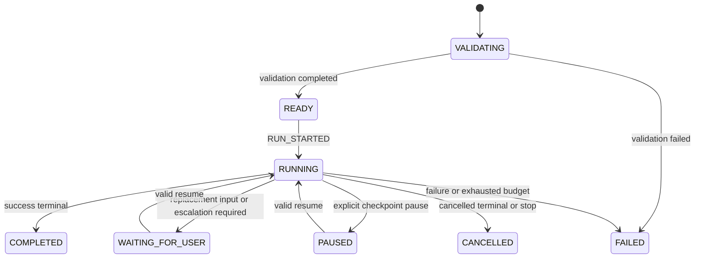

# OralFlow M1 Runtime Semantics

## 1. Status and authority

- Status: M1 implementation contract
- Runtime semantics version: `0.1.0`
- Workflow, Node, Run, and Event Schema version: `0.1.0`
- Applies to: M1 no-GUI deterministic Workflow core

This document defines executable semantics for the contracts frozen in M0. It does not change the serialized Schemas. If an implementation cannot satisfy both this document and an M0 Schema, the owning task stops and proposes a reviewed migration; it must not silently widen or weaken the contract.

## 2. M1 capability boundary

### Supported node kinds

| Kind | M1 behavior |
|---|---|
| `input` | Reads validated initial or resume input |
| `transform` | Calls an allowlisted deterministic transform |
| `gate` | Resolves one path-only expression to a scalar case |
| `terminal` | Ends the Run with `success`, `failure`, or `cancelled` |

### Unsupported node kinds

`agent_task`, `code_task`, `command`, `human_approval`, `subworkflow`, and `artifact` are rejected during Runtime preflight with `NODE_KIND_UNSUPPORTED`. Static M0 validation may still accept these definitions; M1 execution support is intentionally narrower.

### Supported edge kinds

| Kind | M1 behavior |
|---|---|
| `sequence` | Unique unconditional transition from a successful non-gate node |
| `conditional` | Exact case transition from a successful gate |
| `retry` | Bounded transition from the reserved gate case `retry` |
| `error` | Unique structured error route by code or category |

`subworkflow` edges are rejected with `EDGE_KIND_UNSUPPORTED` until the subworkflow milestone.

### Explicit non-goals

M1 does not execute Agent roles, tools, shell commands, source-code tasks, human-approval nodes, subworkflows, model providers, Artifacts, GUI behavior, or English-training logic. Observer and Supervisor remain contract concepts; M1 does not automate their role behavior.

## 3. Runtime preflight

Execution starts only after all checks pass in this order:

1. Load UTF-8 JSON and validate it against the declared Workflow Schema.
2. Run the existing static workflow validator.
3. Require exactly one `input` entry node for M1.
4. Reject unsupported node and edge kinds.
5. Reject artifact and approved-file input bindings; M1 resolves only `workflow-input://` and `node-output://`.
6. Validate the M1 exit-shape rules in section 9.
7. Validate transform identifiers, expression syntax, retry exhaustion modes, and Runtime limits.
8. Compute and pin the canonical Workflow digest.
9. Append validation Events before appending `RUN_STARTED`.

Preflight failure appends `WORKFLOW_VALIDATION_FAILED` when an EventStore is available. It never starts a node and never creates a partially running projection.

## 4. Canonical Workflow identity

A Run pins:

```text
workflow_id
workflow_version
revision
digest
```

The digest is SHA-256 over the complete Workflow object serialized as UTF-8 JSON with:

```text
sort_keys = true
separators = (",", ":")
ensure_ascii = false
allow_nan = false
```

No field is excluded. Resume and replay require all four pinned values to match. A mismatch returns `WORKFLOW_DIGEST_MISMATCH` before any new Event is appended.

## 5. Run state machine

M1 uses this subset of the Run Schema states:



`DRAFT` is a caller-side creation state and is not persisted by the M1 engine. `REPLANNING` is unsupported because Planner/Supervisor execution belongs to a later milestone.

Terminal Run states are immutable. Resume, pause, or append attempts after `COMPLETED`, `FAILED`, or `CANCELLED` return `RUN_TERMINAL`.

Explicit pause is accepted only between node attempts. M1 does not interrupt a synchronous handler midway.

## 6. Node attempt state machine

Each node begins as `IDLE` in the Run projection and follows:

```text
IDLE -> QUEUED -> RUNNING
RUNNING -> SUCCEEDED
RUNNING -> REJECTED
RUNNING -> RETRYABLE_FAILED
RUNNING -> TERMINAL_FAILED
QUEUED -> CANCELLED
```

Re-entering a node through a retry edge increments `attempt_count`. If a user `input` node is queued but no replacement input is available, the node remains `QUEUED` and the Run enters `WAITING_FOR_USER`; after a valid resume it moves to `RUNNING`.

`WAITING_APPROVAL` and `NODE_WAITING_APPROVAL` are reserved for the future `human_approval` node and are not reused for missing input.

## 7. Event invariants

Events are the durable facts. A Run projection is never written as an independent source of truth.

For each Run:

- `sequence` starts at 1 and increases by exactly 1;
- `event_id` is globally unique;
- `run_id`, `workflow_id`, and `workflow_revision` never change;
- node Events include `node_id`;
- `timestamp` comes from an injected clock;
- append uses `expected_last_sequence` and is atomic;
- a conflict returns `EVENT_SEQUENCE_CONFLICT` without an automatic hidden retry;
- correcting history means appending a compensating Event, never updating or deleting an Event.

`causation_event_id` points to the Event that directly caused the new fact. `correlation_id` defaults to the Run ID for M1.

## 8. Runtime Event details

The Event Schema intentionally permits structured `payload.details`. M1 places implementation facts under one namespaced object. Its fully qualified namespace is `payload.details.runtime`:

```json
{
  "payload": {
    "details": {
      "runtime": {
        "semantics_version": "0.1.0"
      }
    }
  }
}
```

Depending on Event type, `runtime` may additionally contain:

```text
workflow_ref
input or input_digest
output or output_digest
incoming_edge_id
transition_index
retry.edge_id
retry.traversal
retry.max_traversals
pause.reason
pause.required_inputs
budget
normalized_error_code
```

Because Event `0.1.0` has no `EDGE_TRAVERSED` type, a target `NODE_QUEUED` Event records `incoming_edge_id`, `transition_index`, and retry counters. This makes the transition replayable without changing the frozen Event Schema.

M1 fixtures contain synthetic data only. Inline input or output must be valid JSON and no larger than 16 KiB in canonical UTF-8 form. Secrets, recordings, real user work material, and large values are rejected with `INLINE_EVENT_DATA_FORBIDDEN` or `INLINE_EVENT_DATA_LIMIT_EXCEEDED`; future Artifact storage will carry such data by reference.

## 9. Deterministic edge selection

Edge selection never depends on file order. Candidate edges are sorted by ID only for stable diagnostics; sorting does not resolve ambiguity.

### Successful non-gate node

- A terminal node selects no edge.
- An `input` or `transform` node must have exactly one eligible `sequence` edge.
- Zero candidates returns `EDGE_SELECTION_NONE`.
- More than one candidate returns `EDGE_SELECTION_AMBIGUOUS`.
- Conditional and retry edges from a non-gate node are rejected during preflight.

### Successful gate node

1. Evaluate the gate expression to one scalar case.
2. Select conditional edges whose expression is identical to the gate expression and whose `case` equals the scalar value.
3. Exactly one match is required.
4. If no conditional edge matches and the scalar case is the reserved string `retry`, exactly one retry edge may be selected.
5. Any other zero or multiple candidate result is an error.

Sequence edges from a gate are rejected during preflight. A conditional edge never falls through implicitly.

### Failed node

1. Consider only `error` edges from the failed node.
2. Exact error-code matches have priority over category matches.
3. Exactly one match at the highest priority is required.
4. No match terminates the Run as failed.
5. Multiple highest-priority matches return `EDGE_SELECTION_AMBIGUOUS` and fail the Run.

Invalid or rejected node output is a failure. It cannot select a success edge or become downstream input.

## 10. `oralflow-expression-0.1`

M1 implements only a path selector:

```ebnf
expression = identifier, { ".", identifier } ;
identifier = letter, { letter | digit | "_" } ;
```

Additional rules:

- maximum expression length remains the Schema limit;
- each path segment must be an own key of a JSON object;
- the resolved value must be a string, number, boolean, or null;
- unknown paths return `EXPRESSION_PATH_UNKNOWN`;
- arrays, indices, calls, operators, whitespace, quoted strings, magic names, attribute access, and coercion are forbidden;
- forbidden segments include names beginning with `__` and the names `constructor`, `prototype`, and `__proto__`;
- implementations must not call Python `eval`, JavaScript `eval`, a shell, a template engine, or dynamic imports.

The M1 toy gate uses `evaluation.case` and returns `qualified` or `retry`.

## 11. Input bindings and node outputs

M1 resolves bindings only from:

- `workflow-input://name` for initial or resume input;
- `node-output://node_id/port` for validated prior output.

Resolution occurs before input Schema validation. Unknown or unavailable values return `NODE_INPUT_REFERENCE_UNAVAILABLE`.

Every attempt follows:

```text
resolve bindings
-> validate input Schema
-> validate config Schema
-> execute allowlisted handler
-> validate output or normalized error
-> append Events
-> select one edge
```

Validated outputs are immutable within an attempt. A later attempt may produce a new output version; replay chooses the latest successful output at or before the current Event sequence.

## 12. M1 handler registry

The initial deterministic handlers are:

| Node kind | Handler identifier | Result |
|---|---|---|
| `input` | built in | Emits the validated input fields |
| `transform` | `uppercase` | Uppercases one declared string without locale or network dependencies |
| `transform` | `length_evaluation` | Emits original text, Unicode code-point length, threshold, and case |
| `gate` | built in | Emits the scalar `case` selected by the path expression |
| `terminal` | built in | Maps the declared outcome to a terminal Run state |

Transform identifiers live in `config.values.transform_id`; unknown identifiers return `TRANSFORM_UNKNOWN`. The length threshold is a positive integer in `config.values.minimum_length` and is validated by the node's embedded config Schema.

Handlers receive values and configuration only. They do not receive EventStore, filesystem, database, network, AgentBackend, or application framework objects.

## 13. Retry and budget semantics

Retry count is tracked per retry edge and persisted on the target `NODE_QUEUED` Event.

- The first traversal has count 1.
- Traversal is allowed only when `count <= max_traversals`.
- `max_traversals` never resets on pause, resume, Engine recreation, or replay.
- Node `max_attempts`, edge `max_traversals`, Workflow `max_total_transitions`, `max_duration_seconds`, and `max_failures` are all enforced; the first exhausted bound wins.
- Duration uses an injected monotonic clock for decisions and Event timestamps for evidence.

M1 exhaustion behavior:

| `on_exhausted` | Result |
|---|---|
| `fail` | Append structured `RETRY_EXHAUSTED`, then `RUN_FAILED` |
| `stop` | Append the exhaustion reason, then `RUN_CANCELLED` |
| `escalate` | Enter `WAITING_FOR_USER`; M1 permits inspect or cancel, not an extra hidden traversal |
| `replan` | Rejected during preflight as `REPLAN_UNSUPPORTED` |

Backoff seconds are computed deterministically from the declared policy. Waiting is delegated to an injected delay strategy; tests use a recording strategy and never block or sleep.

## 14. Pause and resume

M1 supports two pause reasons:

- `input_required`: a retry re-entered an input node without replacement data; Run becomes `WAITING_FOR_USER`;
- `explicit_checkpoint`: caller requested pause between attempts; Run becomes `PAUSED`.

A resume request must include:

```text
run_id
pinned Workflow reference
expected_last_sequence
resume payload
```

Resume validates all fields and the required input Schema before appending `RUN_RESUMED`. Stale sequence, wrong digest, terminal Run, unexpected payload, or duplicate resume appends nothing and returns a stable error.

An escalation pause caused by exhausted retry cannot grant another traversal beyond the declared maximum. M1 allows only inspection or cancellation from that state.

## 15. Projection and replay

The projector is a pure fold:

```text
project(workflow_definition, ordered_events) -> Run
```

Before folding, it verifies:

- canonical Workflow digest;
- Event Schema validity;
- continuous sequence;
- constant Run and Workflow identity;
- legal Run and Node state transitions;
- referenced node IDs exist;
- retry and transition counters never decrease.

The projector does not call node handlers and does not infer missing Events. Given the same definition and Events, serialized Run output must be byte-for-byte identical after canonical serialization.

Live execution state is obtained by applying the same projector after successful Event appends. Live and replay projections must compare equal in acceptance tests.

## 16. EventStore boundary

The conceptual interface is:

```text
append(event, expected_last_sequence)
load(run_id) -> ordered events
last_sequence(run_id) -> integer
```

M1 first provides an in-memory implementation, then a standard-library SQLite implementation. Both pass one shared contract suite.

SQLite rules:

- append-only table;
- unique `event_id`;
- unique `(run_id, sequence)`;
- transaction around expected-sequence check and insert;
- no update or delete Runtime operation;
- tests use temporary databases only;
- serialized Event JSON is the stored fact; indexes do not become an alternate source of truth.

## 17. Stable Runtime errors

M1 uses the common structured error envelope. Initial stable codes include:

```text
WORKFLOW_DIGEST_MISMATCH
WORKFLOW_ENTRY_COUNT_INVALID
NODE_KIND_UNSUPPORTED
EDGE_KIND_UNSUPPORTED
REPLAN_UNSUPPORTED
TRANSFORM_UNKNOWN
EXPRESSION_INVALID
EXPRESSION_PATH_UNKNOWN
NODE_INPUT_REFERENCE_UNAVAILABLE
NODE_INPUT_INVALID
NODE_OUTPUT_INVALID
NODE_INTERNAL_ERROR
EDGE_SELECTION_NONE
EDGE_SELECTION_AMBIGUOUS
EVENT_SEQUENCE_CONFLICT
EVENT_TRANSITION_INVALID
INLINE_EVENT_DATA_FORBIDDEN
INLINE_EVENT_DATA_LIMIT_EXCEEDED
RETRY_EXHAUSTED
RUN_BUDGET_EXHAUSTED
RUN_RESUME_CONFLICT
RUN_TERMINAL
```

Raw exceptions, stack traces, secrets, database paths, and unbounded output are not Event error messages. Full local diagnostics remain test or redacted development evidence.

## 18. M1 acceptance scenarios

The synthetic toy Workflow is:

```text
Text Input
-> Uppercase Transform
-> Length Evaluation
-> Gate (evaluation.case)
   -> qualified -> Complete
   -> retry -> Text Input (max 2 traversals)
```

Acceptance covers:

1. A qualifying first input completes through sequence and conditional edges.
2. A short input returns through retry and pauses when replacement input is absent.
3. Resume with qualifying replacement input completes.
4. Repeated short inputs exhaust exactly at the declared limit and never deadlock.
5. Error output never reaches a success edge.
6. Explicit pause and resume work only at a checkpoint.
7. Recreating the Engine over SQLite yields the same Run projection.
8. Live and replay projections are identical.
9. Every Event and final Run pass the frozen Schemas.
10. No test calls a network, model, shell, production database, or real user material.
